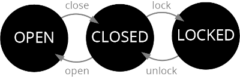

# The C# Player's Guide - Part 2: Object Oriented Programming


## Chapter 15: Object-Oriented Concepts
- No assignments for this chapter.

## Chapter 16: Enumerations

### From The Book

- [x] Project 1 - Simul's Test
  - Simulate the locking mechanism of a chest.
  - Define an enumeration for the state of the chest.
  - Make a variable whose type is this new enumeration.
  - Write code to allow you to manipulate the chest with the lock, unlock, open, and close
commands, but ensure that you don’t transition between states that don’t support it.
  - Loop forever, asking for the next command.
  - The program below shows what using this might look like:
    ```
    The chest is locked. What do you want to do? unlock
    The chest is unlocked. What do you want to do? open
    The chest is open. What do you want to do? close
    The chest is unlocked. What do you want to do?
    ```
    


## Chapter 17: Tuples

### From The Book
- [x] Project 1 - Simula's Soup
  - Define enumerations for the three variations on food: type (soup, stew, gumbo), main ingredient
(mushrooms, chicken, carrots, potatoes), and seasoning (spicy, salty, sweet).
  - Make a tuple variable to represent a soup composed of the three above enumeration types.
  - Let the user pick a type, main ingredient, and seasoning from the allowed choices and fill the tuple
with the results. Hint: You could give the user a menu to pick from or simply compare the user’s
text input against specific strings to determine which enumeration value represents their choice.
  - When done, display the contents of the soup tuple variable in a format like “Sweet Chicken Gumbo.”
Hint: You don’t need to convert the enumeration value back to a string. Simply displaying an
enumeration value with Write or WriteLine will display the name of the enumeration value.)

### From ChatGPT

- [x] Project 2 - Return Stats
  - Return min, max, average from method.
    
- [x] Project 3 - Split Name
  - Return (first, last) from full name.
    
- [x] Project 4 - Rectangle Info
  - Return area and perimeter as tuple.

- [x] Project 5 - Coordinate Finder
  - Return (x, y) from direction input.

  
## Chapter 18: Classes

### From The Book
- [x] Project 1 - Vin Fletcher’s Arrows
  - Each arrow has three parts: the arrowhead (steel, wood, or obsidian), the shaft (a length between 60 and
100 cm long), and the fletching (plastic, turkey feathers, or goose feathers).
  - His costs are as follows: 
    - For arrowheads, steel costs 10 gold, wood costs 3 gold, and obsidian costs 5 gold.
    - For fletching, plastic costs 10 gold, turkey feathers cost 5 gold, and goose feathers cost 3 gold. 
    - For the shaft, the price depends on the length: 0.05 gold per centimeter.
  - Objectives:
    - Define a new Arrow class with fields for arrowhead type, fletching type, and length. (Hint:
arrowhead types and fletching types might be good enumerations.)
    - Allow a user to pick the arrowhead, fletching type, and length and then create a new Arrow instance.
    - Add a GetCost method that returns its cost as a float based on the numbers above, and use this
to display the arrow’s cost.

### From ChatGPT
- [x] Project 2
  - Create Player – With name, level, and score.
  - Create Book – Title, author, pages.
  - Display Object Info – Print object data with method.
  - Compare Two Books – Check which has more pages.
  - Inventory List – Use class to hold multiple item objects.

  
## Chapter 19: Information Hiding

### From The Book
- [x] Project 1 - Vin’s Trouble
  - Modify your Arrow class to have private instead of public fields.
  - Add in getter methods for each of the fields that you have.


## Chapter 20: Properties

### From The Book
- [x] Project 1 - The Properties of Arrows
  - Modify your Arrow class to use properties instead of GetX and SetX methods.
  - Ensure the whole program can still run.

### From ChatGPT
- [x] Project 2
  - Auto Property Player – Add Health, Mana, XP.
  - Read-Only ID – Use get only for a unique ID.
  - Validation – Set Age but block < 0.
  - Property Method – Calculate IsAlive from Health.
  - Display All Properties – Loop and print them.


## Chapter 21: Static

### From The Book
- [x] Project 1 - Arrow Factories
  - Vin Fletcher sometimes makes custom-ordered arrows, but these are rare. Most of the time, he sells one
of the following standard arrows:
    - The Elite Arrow, made from a steel arrowhead, plastic fletching, and a 95 cm shaft.
    - The Beginner Arrow, made from a wood arrowhead, goose feathers, and a 75 cm shaft.
    - The Marksman Arrow, made from a steel arrowhead, goose feathers, and a 65 cm shaft.
  - You can make static methods to make these specific variations of arrows easy.
  - Objectives:
    - Modify your Arrow class one final time to include static methods of the form public static
Arrow CreateEliteArrow() { ... } for each of the three above arrow types.
    - Modify the program to allow users to choose one of these pre-defined types or a custom arrow. If
they select one of the predefined styles, produce an Arrow instance using one of the new static
methods. If they choose to make a custom arrow, use your earlier code to get their custom data
about the desired arrow.


## Chapter 22: Null References

### From ChatGPT
- [x] Project 1
  - Null Name Check – Warn if name is null.
  - Default Description – Use null-coalescing.
 

## Chapter 23: Object-Oriented Design
- No assignments for this chapter.


## Chapter 24: The Catacombs of the Class

### From The book
- [x] Project 1 - the Point
  - Define a new Point class with properties for X and Y.
  - Add a constructor to create a point from a specific x- and y-coordinate.
  - Add a parameterless constructor to create a point at the origin (0, 0).
  - In your main method, create a point at (2, 3) and another at (-4, 0). Display these points on the
console window in the format (x, y) to illustrate that the class works.

- [x] Project 2 - The Color
  - Create a Color class to represent a color. The color consists of three parts or channels: red, green, and blue, 
which indicate how much those channels are lit up. Each channel can be from 0 to 255. 0 means completely off; 
255 means completely on.
  - These are commonly used colors: White (255, 255, 255), Black (0, 0, 0), Red (255, 0, 0),
Orange (255,165, 0), Yellow (255, 255, 0), Green (0, 128, 0), Blue (0, 0, 255), Purple (128, 0, 128).
  - Objectives:
    - Define a new Color class with properties for its red, green, and blue channels.
    - Add appropriate constructors that you feel make sense for creating new Color objects.
    - Create static properties to define the eight commonly used colors for easy access.
    - In your main method, make two Color-typed variables. Use a constructor to create a color instance
and use a static property for the other. Display each of their red, green, and blue channel values.

- [x] Project 3 - The Card
  - Each card has a color (red, green, blue, yellow) and a rank (the numbers 1 through 10, followed by the symbols $, %, ^, and &). Create a class to represent a card of this nature.
  - Objectives:
    - Define enumerations for card colors and card ranks.
    - Define a Card class to represent a card with a color and a rank, as described above.
    - Add properties or methods that tell you if a card is a number or symbol card (the equivalent of a
face card).
    - Create a main method that will create a card instance for the whole deck (every color with every
rank) and display each (for example, “The Red Ampersand” and “The Blue Seven”).

- [x] Project 4 - The Locked Door
  - Construct a door class with a locking mechanism that requires a unique numeric code to unlock. 
  You have done something similar before without using a class, but the locking mechanism is new. 
  The door should only unlock if the passcode is the right one. The following statements describe 
  how the door works.
    - An open door can always be closed.
    - A closed (but not locked) door can always be opened.
    - A closed door can always be locked.
    - A locked door can be unlocked, but a numeric passcode is needed, and the door will only unlock if
the code supplied matches the door’s current passcode.
  - When a door is created, it must be given an initial passcode.
  - Additionally, you should be able to change the passcode by supplying the current code and a new
one. The passcode should only change if the correct, current code is given.
  - Objectives:
    - Define a Door class that can keep track of whether it is locked, open, or closed.
    - Make it so you can perform the four transitions defined above with methods.
    - Build a constructor that requires the starting numeric passcode.
    - Build a method that will allow you to change the passcode for an existing door by supplying the
current passcode and new passcode. Only change the passcode if the current passcode is correct.
    - Make your main method ask the user for a starting passcode, then create a new Door instance. Allow
the user to attempt the four transitions described above (open, close, lock, unlock) and change the
code by typing in text commands.

- [x] Project 5 - The Password Validator
  - You must create a class that can determine if a password is valid (meets the rules
defined for a legitimate password).The following rules must apply:
    - Passwords must be at least 6 letters long and no more than 13 letters long.
    - Passwords must contain at least one uppercase letter, one lowercase letter, and one number.
    - Passwords cannot contain a capital T or an ampersand (&) 
    - Hints: 
      - foreach with a string lets you get its characters!
      - char has static methods to categorize letters! char.IsUpper('A'), char.IsLower('a'), char.IsDigit('0')
    - Objectives: 
      - Define a new PasswordValidator class that can be given a password and determine if the
password follows the rules above. 
      - Make your main method loop forever, asking for a password and reporting whether the password is
allowed using an instance of the PasswordValidator class.

- [x] Project 6 - Tic-Tac-Toe
  - Your job is to recreate the game of Tic-Tac-Toe, allowing two players to compete against each other. The
following features are required:
    - Two human players take turns entering their choice using the same keyboard.
    - The players designate which square they want to play in. Hint: You might consider using the number
pad as a guide. For example, if they enter 7, they have chosen the top left corner of the board.
    - The game should prevent players from choosing squares that are already occupied. If such a move
is attempted, the player should be told of the problem and given another chance.
    - The game must detect when a player wins or when the board is full with no winner (draw/”cat”).
    - When the game is over, the outcome is displayed to the players.
    - The state of the board must be displayed to the player after each play. Hint: One possible way to
show the board could be like this:
        ```
        It is X's turn.
        | X |   |
         ---+---+---
        | O | X |
        ---+---+---
          O |   |
        What square do you want to play in?
        ```


## Chapter 25: Inheritance

### From The Book
- [x] Project 1 - Packing Inventory
  - You decide to create a Pack class to help in holding your items. Each pack has three limits: the total
number of items it can hold, the weight it can carry, and the volume it can hold. Each item has a weight
and volume, and you must not overload a pack by adding too many items, too much weight, or too much
volume.
  - There are many item types that you might add to your inventory, each their own class in the inventory
system. 
    - (1) An arrow has a weight of 0.1 and a volume of 0.05. 
    - (2) A bow has a weight of 1 and a volume of 4. 
    - (3) Rope has a weight of 1 and a volume of 1.5. 
    - (4) Water has a weight of 2 and a volume of 3. 
    - (5) Food rations have a weight of 1 and a volume of 0.5. 
    - (6) A sword has a weight of 5 and a volume of 3.
  - Objectives:
    - Create an InventoryItem class that represents any of the different item types. This class must
represent the item’s weight and volume, which it needs at creation time (constructor).
    - Create derived classes for each of the types of items above. Each class should pass the correct weight
and volume to the base class constructor but should be creatable themselves with a parameterless
constructor (for example, new Rope() or new Sword()).
    - Build a Pack class that can store an array of items. The total number of items, the maximum weight,
and the maximum volume are provided at creation time and cannot change afterward.
    - Make a public bool Add(InventoryItem item) method to Pack that allows you to add items
of any type to the pack’s contents. This method should fail (return false and not modify the pack’s
fields) if adding the item would cause it to exceed the pack’s item, weight, or volume limit.
    - Add properties to Pack that allow it to report the current item count, weight, and volume, and the
limits of each.
    - Create a program that creates a new pack and then allow the user to add (or attempt to add) items
chosen from a menu.


## Chapter 26: Polymorphism

### From The Book
- [x] Project 1 - Labeling Inventory
  - Modify your inventory program from the previous chapter as described below.
    - Override the existing ToString method (from the object base class) on all of your inventory item
subclasses to give them a name. For example, new Rope().ToString() should return "Rope".
    - Override ToString on the Pack class to display the contents of the pack. If a pack contains water,
rope, and two arrows, then calling ToString on that Pack object could look like "Pack containing Water 
Rope Arrow Arrow".
    - Before the user chooses the next item to add, display the pack’s current contents via its new
ToString method.

- [x] Project 2 - The Old Robot
  - You spot something shiny, half-buried in the mud. As you knock off the cakedon mud, you realize 
  that it seems like this old automaton might even be programmable if you can give it the proper commands. The automaton seems to be structured like this:
    ```
    public class Robot
    {
        public int X { get; set; }
        public int Y { get; set; }
        public bool IsPowered { get; set; }
        public RobotCommand?[] Commands { get; } = new RobotCommand?[3];
        public void Run()
        {
            foreach (RobotCommand? command in Commands)
            {
                command?.Run(this);
                Console.WriteLine($"[{X} {Y} {IsPowered}]");
            }
        }
    }
    ```
  - You don’t see a definition of that RobotCommand class. Still, you think you might be able to recreate it
(a class with only an abstract Run command) and then make derived classes that extend RobotCommand
that move it in each of the four directions and power it on and off. 
  - Objectives:
    - Copy the code above into a new project.
    - Create a RobotCommand class with a public and abstract void Run(Robot robot) method. (The
code above should compile after this step.)
    - Make OnCommand and OffCommand classes that inherit from RobotCommand and turn the robot
on or off by overriding the Run method.
    - Make a NorthCommand, SouthCommand, WestCommand, and EastCommand that move the robot 1
unit in the +Y direction, 1 unit in the -Y direction, 1 unit in the -X direction, and 1 unit in the +X
direction, respectively. Also, ensure that these commands only work if the robot’s IsPowered
property is true.
    - Make your main method able to collect three commands from the console window. Generate new
RobotCommand objects based on the text entered. After filling the robot’s command set with these
new RobotCommand objects, use the robot’s Run method to execute them. For example:
        ```
        on
        north
        west
        [0 0 True]
        [0 1 True]
        [-1 1 True]
        ```

 
## Chapter 27: Interfaces

### From The Book
- [x] Project 1 - Robotic Interface
  - Building on your solution to the Old Robot challenge, perform the changes below:
    - Change your abstract RobotCommand class into an IRobotCommand interface.
    - Remove the unnecessary public and abstract keywords from the Run method.
    - Change the Robot class to use IRobotCommand instead of RobotCommand.
    - Make all of your commands implement this new interface instead of extending the RobotCommand
class that no longer exists. You will also want to remove the override keywords in these classes.
    - Ensure your program still compiles and runs.


### From ChatGPT
    1. ILogger – Multiple classes implement Log() differently.
    2. ISaveable – Add Save() and Load() methods.
    3. IDrawable – Render shapes using shared interface.
    4. Inventory System – Use interface to add/remove items.
    5. Composite Interface – Implement multiple interfaces in one object.

Chapter 28: Structs
    1. Vector2 – Struct with X and Y, and Length() method.
    2. Point Immutable – Read-only struct.
    3. Struct Copy Behavior – Copy and show difference.
    4. Timer Struct – Store time intervals.
    5. Rectangle Struct – Add Width, Height, Area.

Chapter 29: Records
    1. Contact Record – With Name, Phone.
    2. Equality Test – Compare two records.
    3. With Expression – Clone record and change one field.
    4. Positional Record – Use compact syntax.
    5. Data Model – Store data in immutable records.

Chapter 30: Generics
    1. Pair<T1, T2> – Hold two values of any type.
    2. Generic Stack – Push and pop any type.
    3. Swap<T> – Swap two values.
    4. Constraints – Add where T : IComparable.
    5. Repository<T> – Simulate data repository.

Chapter 31: Fountain of Objects
    1. Grid Builder – Create grid of rooms.
    2. Movement System – Move through grid.
    3. Add Obstacles – Add pits, monsters, fountains.
    4. Goal Condition – Activate fountain and exit safely.
    5. Track State – Save location, HP, and status.

Chapter 32: Useful Types
    1. Dice Roller – Use Random class.
    2. Date Difference – Use DateTime to count days.
    3. Stopwatch – Time an operation with TimeSpan.
    4. GUID Generator – Generate a unique ID.
    5. List Inventory – Add/remove items from a List<string>.

