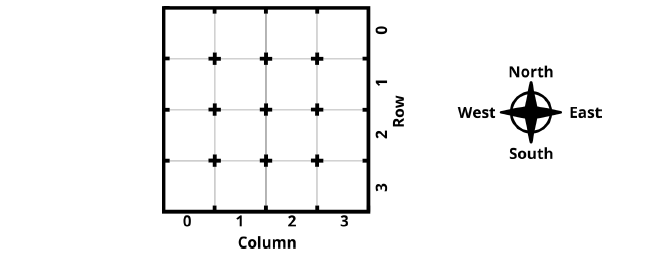

# The C# Player's Guide - Part 2: Object Oriented Programming


## Chapter 15: Object-Oriented Concepts
- No assignments for this chapter.

## Chapter 16: Enumerations

### From The Book

- [x] Project 1 - Simul's Test
  - Simulate the locking mechanism of a chest.
  - Define an enumeration for the state of the chest.
  - Make a variable whose type is this new enumeration.
  - Write code to allow you to manipulate the chest with the lock, unlock, open, and close
commands, but ensure that you don’t transition between states that don’t support it.
  - Loop forever, asking for the next command.
  - The program below shows what using this might look like:
    ```
    The chest is locked. What do you want to do? unlock
    The chest is unlocked. What do you want to do? open
    The chest is open. What do you want to do? close
    The chest is unlocked. What do you want to do?
    ```
    


## Chapter 17: Tuples

### From The Book
- [x] Project 1 - Simula's Soup
  - Define enumerations for the three variations on food: type (soup, stew, gumbo), main ingredient
(mushrooms, chicken, carrots, potatoes), and seasoning (spicy, salty, sweet).
  - Make a tuple variable to represent a soup composed of the three above enumeration types.
  - Let the user pick a type, main ingredient, and seasoning from the allowed choices and fill the tuple
with the results. Hint: You could give the user a menu to pick from or simply compare the user’s
text input against specific strings to determine which enumeration value represents their choice.
  - When done, display the contents of the soup tuple variable in a format like “Sweet Chicken Gumbo.”
Hint: You don’t need to convert the enumeration value back to a string. Simply displaying an
enumeration value with Write or WriteLine will display the name of the enumeration value.)

### From ChatGPT

- [x] Project 2 - Return Stats
  - Return min, max, average from method.
    
- [x] Project 3 - Split Name
  - Return (first, last) from full name.
    
- [x] Project 4 - Rectangle Info
  - Return area and perimeter as tuple.

- [x] Project 5 - Coordinate Finder
  - Return (x, y) from direction input.

  
## Chapter 18: Classes

### From The Book
- [x] Project 1 - Vin Fletcher’s Arrows
  - Each arrow has three parts: the arrowhead (steel, wood, or obsidian), the shaft (a length between 60 and
100 cm long), and the fletching (plastic, turkey feathers, or goose feathers).
  - His costs are as follows: 
    - For arrowheads, steel costs 10 gold, wood costs 3 gold, and obsidian costs 5 gold.
    - For fletching, plastic costs 10 gold, turkey feathers cost 5 gold, and goose feathers cost 3 gold. 
    - For the shaft, the price depends on the length: 0.05 gold per centimeter.
  - Objectives:
    - Define a new Arrow class with fields for arrowhead type, fletching type, and length. (Hint:
arrowhead types and fletching types might be good enumerations.)
    - Allow a user to pick the arrowhead, fletching type, and length and then create a new Arrow instance.
    - Add a GetCost method that returns its cost as a float based on the numbers above, and use this
to display the arrow’s cost.

### From ChatGPT
- [x] Project 2
  - Create Player – With name, level, and score.
  - Create Book – Title, author, pages.
  - Display Object Info – Print object data with method.
  - Compare Two Books – Check which has more pages.
  - Inventory List – Use class to hold multiple item objects.

  
## Chapter 19: Information Hiding

### From The Book
- [x] Project 1 - Vin’s Trouble
  - Modify your Arrow class to have private instead of public fields.
  - Add in getter methods for each of the fields that you have.


## Chapter 20: Properties

### From The Book
- [x] Project 1 - The Properties of Arrows
  - Modify your Arrow class to use properties instead of GetX and SetX methods.
  - Ensure the whole program can still run.

### From ChatGPT
- [x] Project 2
  - Auto Property Player – Add Health, Mana, XP.
  - Read-Only ID – Use get only for a unique ID.
  - Validation – Set Age but block < 0.
  - Property Method – Calculate IsAlive from Health.
  - Display All Properties – Loop and print them.


## Chapter 21: Static

### From The Book
- [x] Project 1 - Arrow Factories
  - Vin Fletcher sometimes makes custom-ordered arrows, but these are rare. Most of the time, he sells one
of the following standard arrows:
    - The Elite Arrow, made from a steel arrowhead, plastic fletching, and a 95 cm shaft.
    - The Beginner Arrow, made from a wood arrowhead, goose feathers, and a 75 cm shaft.
    - The Marksman Arrow, made from a steel arrowhead, goose feathers, and a 65 cm shaft.
  - You can make static methods to make these specific variations of arrows easy.
  - Objectives:
    - Modify your Arrow class one final time to include static methods of the form public static
Arrow CreateEliteArrow() { ... } for each of the three above arrow types.
    - Modify the program to allow users to choose one of these pre-defined types or a custom arrow. If
they select one of the predefined styles, produce an Arrow instance using one of the new static
methods. If they choose to make a custom arrow, use your earlier code to get their custom data
about the desired arrow.


## Chapter 22: Null References

### From ChatGPT
- [x] Project 1
  - Null Name Check – Warn if name is null.
  - Default Description – Use null-coalescing.
 

## Chapter 23: Object-Oriented Design
- No assignments for this chapter.


## Chapter 24: The Catacombs of the Class

### From The book
- [x] Project 1 - the Point
  - Define a new Point class with properties for X and Y.
  - Add a constructor to create a point from a specific x- and y-coordinate.
  - Add a parameterless constructor to create a point at the origin (0, 0).
  - In your main method, create a point at (2, 3) and another at (-4, 0). Display these points on the
console window in the format (x, y) to illustrate that the class works.

- [x] Project 2 - The Color
  - Create a Color class to represent a color. The color consists of three parts or channels: red, green, and blue, 
which indicate how much those channels are lit up. Each channel can be from 0 to 255. 0 means completely off; 
255 means completely on.
  - These are commonly used colors: White (255, 255, 255), Black (0, 0, 0), Red (255, 0, 0),
Orange (255,165, 0), Yellow (255, 255, 0), Green (0, 128, 0), Blue (0, 0, 255), Purple (128, 0, 128).
  - Objectives:
    - Define a new Color class with properties for its red, green, and blue channels.
    - Add appropriate constructors that you feel make sense for creating new Color objects.
    - Create static properties to define the eight commonly used colors for easy access.
    - In your main method, make two Color-typed variables. Use a constructor to create a color instance
and use a static property for the other. Display each of their red, green, and blue channel values.

- [x] Project 3 - The Card
  - Each card has a color (red, green, blue, yellow) and a rank (the numbers 1 through 10, followed by the symbols $, %, ^, and &). Create a class to represent a card of this nature.
  - Objectives:
    - Define enumerations for card colors and card ranks.
    - Define a Card class to represent a card with a color and a rank, as described above.
    - Add properties or methods that tell you if a card is a number or symbol card (the equivalent of a
face card).
    - Create a main method that will create a card instance for the whole deck (every color with every
rank) and display each (for example, “The Red Ampersand” and “The Blue Seven”).

- [x] Project 4 - The Locked Door
  - Construct a door class with a locking mechanism that requires a unique numeric code to unlock. 
  You have done something similar before without using a class, but the locking mechanism is new. 
  The door should only unlock if the passcode is the right one. The following statements describe 
  how the door works.
    - An open door can always be closed.
    - A closed (but not locked) door can always be opened.
    - A closed door can always be locked.
    - A locked door can be unlocked, but a numeric passcode is needed, and the door will only unlock if
the code supplied matches the door’s current passcode.
  - When a door is created, it must be given an initial passcode.
  - Additionally, you should be able to change the passcode by supplying the current code and a new
one. The passcode should only change if the correct, current code is given.
  - Objectives:
    - Define a Door class that can keep track of whether it is locked, open, or closed.
    - Make it so you can perform the four transitions defined above with methods.
    - Build a constructor that requires the starting numeric passcode.
    - Build a method that will allow you to change the passcode for an existing door by supplying the
current passcode and new passcode. Only change the passcode if the current passcode is correct.
    - Make your main method ask the user for a starting passcode, then create a new Door instance. Allow
the user to attempt the four transitions described above (open, close, lock, unlock) and change the
code by typing in text commands.

- [x] Project 5 - The Password Validator
  - You must create a class that can determine if a password is valid (meets the rules
defined for a legitimate password).The following rules must apply:
    - Passwords must be at least 6 letters long and no more than 13 letters long.
    - Passwords must contain at least one uppercase letter, one lowercase letter, and one number.
    - Passwords cannot contain a capital T or an ampersand (&) 
    - Hints: 
      - foreach with a string lets you get its characters!
      - char has static methods to categorize letters! char.IsUpper('A'), char.IsLower('a'), char.IsDigit('0')
    - Objectives: 
      - Define a new PasswordValidator class that can be given a password and determine if the
password follows the rules above. 
      - Make your main method loop forever, asking for a password and reporting whether the password is
allowed using an instance of the PasswordValidator class.

- [x] Project 6 - Tic-Tac-Toe
  - Your job is to recreate the game of Tic-Tac-Toe, allowing two players to compete against each other. The
following features are required:
    - Two human players take turns entering their choice using the same keyboard.
    - The players designate which square they want to play in. Hint: You might consider using the number
pad as a guide. For example, if they enter 7, they have chosen the top left corner of the board.
    - The game should prevent players from choosing squares that are already occupied. If such a move
is attempted, the player should be told of the problem and given another chance.
    - The game must detect when a player wins or when the board is full with no winner (draw/”cat”).
    - When the game is over, the outcome is displayed to the players.
    - The state of the board must be displayed to the player after each play. Hint: One possible way to
show the board could be like this:
        ```
        It is X's turn.
        | X |   |
         ---+---+---
        | O | X |
        ---+---+---
          O |   |
        What square do you want to play in?
        ```


## Chapter 25: Inheritance

### From The Book
- [x] Project 1 - Packing Inventory
  - You decide to create a Pack class to help in holding your items. Each pack has three limits: the total
number of items it can hold, the weight it can carry, and the volume it can hold. Each item has a weight
and volume, and you must not overload a pack by adding too many items, too much weight, or too much
volume.
  - There are many item types that you might add to your inventory, each their own class in the inventory
system. 
    - (1) An arrow has a weight of 0.1 and a volume of 0.05. 
    - (2) A bow has a weight of 1 and a volume of 4. 
    - (3) Rope has a weight of 1 and a volume of 1.5. 
    - (4) Water has a weight of 2 and a volume of 3. 
    - (5) Food rations have a weight of 1 and a volume of 0.5. 
    - (6) A sword has a weight of 5 and a volume of 3.
  - Objectives:
    - Create an InventoryItem class that represents any of the different item types. This class must
represent the item’s weight and volume, which it needs at creation time (constructor).
    - Create derived classes for each of the types of items above. Each class should pass the correct weight
and volume to the base class constructor but should be creatable themselves with a parameterless
constructor (for example, new Rope() or new Sword()).
    - Build a Pack class that can store an array of items. The total number of items, the maximum weight,
and the maximum volume are provided at creation time and cannot change afterward.
    - Make a public bool Add(InventoryItem item) method to Pack that allows you to add items
of any type to the pack’s contents. This method should fail (return false and not modify the pack’s
fields) if adding the item would cause it to exceed the pack’s item, weight, or volume limit.
    - Add properties to Pack that allow it to report the current item count, weight, and volume, and the
limits of each.
    - Create a program that creates a new pack and then allow the user to add (or attempt to add) items
chosen from a menu.


## Chapter 26: Polymorphism

### From The Book
- [x] Project 1 - Labeling Inventory
  - Modify your inventory program from the previous chapter as described below.
    - Override the existing ToString method (from the object base class) on all of your inventory item
subclasses to give them a name. For example, new Rope().ToString() should return "Rope".
    - Override ToString on the Pack class to display the contents of the pack. If a pack contains water,
rope, and two arrows, then calling ToString on that Pack object could look like "Pack containing Water 
Rope Arrow Arrow".
    - Before the user chooses the next item to add, display the pack’s current contents via its new
ToString method.

- [x] Project 2 - The Old Robot
  - You spot something shiny, half-buried in the mud. As you knock off the cakedon mud, you realize 
  that it seems like this old automaton might even be programmable if you can give it the proper commands. The automaton seems to be structured like this:
    ```
    public class Robot
    {
        public int X { get; set; }
        public int Y { get; set; }
        public bool IsPowered { get; set; }
        public RobotCommand?[] Commands { get; } = new RobotCommand?[3];
        public void Run()
        {
            foreach (RobotCommand? command in Commands)
            {
                command?.Run(this);
                Console.WriteLine($"[{X} {Y} {IsPowered}]");
            }
        }
    }
    ```
  - You don’t see a definition of that RobotCommand class. Still, you think you might be able to recreate it
(a class with only an abstract Run command) and then make derived classes that extend RobotCommand
that move it in each of the four directions and power it on and off. 
  - Objectives:
    - Copy the code above into a new project.
    - Create a RobotCommand class with a public and abstract void Run(Robot robot) method. (The
code above should compile after this step.)
    - Make OnCommand and OffCommand classes that inherit from RobotCommand and turn the robot
on or off by overriding the Run method.
    - Make a NorthCommand, SouthCommand, WestCommand, and EastCommand that move the robot 1
unit in the +Y direction, 1 unit in the -Y direction, 1 unit in the -X direction, and 1 unit in the +X
direction, respectively. Also, ensure that these commands only work if the robot’s IsPowered
property is true.
    - Make your main method able to collect three commands from the console window. Generate new
RobotCommand objects based on the text entered. After filling the robot’s command set with these
new RobotCommand objects, use the robot’s Run method to execute them. For example:
        ```
        on
        north
        west
        [0 0 True]
        [0 1 True]
        [-1 1 True]
        ```

 
## Chapter 27: Interfaces

### From The Book
- [x] Project 1 - Robotic Interface
  - Building on your solution to the Old Robot challenge, perform the changes below:
    - Change your abstract RobotCommand class into an IRobotCommand interface.
    - Remove the unnecessary public and abstract keywords from the Run method.
    - Change the Robot class to use IRobotCommand instead of RobotCommand.
    - Make all of your commands implement this new interface instead of extending the RobotCommand
class that no longer exists. You will also want to remove the override keywords in these classes.
    - Ensure your program still compiles and runs.


### From ChatGPT
- [x] Project 2
  - ILogger – Multiple classes implement Log() differently.
  - Composite Interface – Implement multiple interfaces in one object.

  
## Chapter 28: Structs

### From The Book
- [x] Project 1 - Room Coordinates
  - Create a Coordinate struct that can represent a room coordinate with a row and column
  - Ensure Coordinate is immutable.
  - Make a method to determine if one coordinate is adjacent to another (differing only by a single row
or column).
  - Write a main method that creates a few coordinates and determines if they are adjacent to each
other to prove that it is working correctly.


## Chapter 29: Records

### From The Book
- [x] Project 1 - War Preparations
  - Make a program that can create swords
    - Swords can be made out of any of the following materials: wood, bronze, iron, steel, and the rare
binarium. Create an enumeration to represent the material type.
    - Gemstones can be attached to a sword, which gives them strange powers through Cygnus and Lyra’s
touch. Gemstone types include emerald, amber, sapphire, diamond, and the rare bitstone. Or no
gemstone at all. Create an enumeration to represent a gemstone type.
    - Create a Sword record with a material, gemstone, length, and crossguard width.
    - In your main program, create a basic Sword instance made out of iron and with no gemstone. Then
create two variations on the basic sword using with expressions.
    - Display all three sword instances with code like Console.WriteLine(original);.

### From ChatGPT
- [x] Project 2
  - Contact Record – With Name, Phone.
  - Equality Test – Compare two records.
  - With Expression – Clone record and change one field.


## Chapter 30: Generics

### From The Book
- [x] Project 1 - Colored Items
  - You have a sword, a bow, and an axe in front of you, defined like this:
    ```
    public class Sword { }
    public class Bow { }
    public class Axe { }
    ```
  - You want to associate a color with these items (or any item type). You could make ColoredSword
derived from Sword that adds a Color property, but doing this for all three item types will be
painstaking. Instead, you define a new generic ColoredItem class that does this for any item.
  - Objectives:
    - Put the three class definitions above into a new project.
    - Define a generic class to represent a colored item. It must have properties for the item itself (generic
in type) and a ConsoleColor associated with it.
    - Add a void Display() method to your colored item type that changes the console’s foreground
color to the item’s color and displays the item in that color. (Hint: It is sufficient to just call
ToString() on the item to get a text representation.)
    - In your main method, create a new colored item containing a blue sword, a red bow, and a green axe.
Display all three items to see each item displayed in its color.


## Chapter 31: Fountain of Objects

### From The Book
- [x] Project 1 - The Fountain of Objects
  - The Fountain of Objects game is a 2D grid-based world full of rooms. Most rooms are empty, but a few
are unique rooms. One room is the cavern entrance. Another is the fountain room, containing the
Fountain of Objects.
  - The player moves through the cavern system one room at a time to find the Fountain of Objects. They
activate it and then return to the entrance room. If they do this without falling into a pit, they win the
game.
  - Unnatural darkness pervades the caverns, preventing both natural and human-made light. The player
must navigate the caverns in the dark, relying on their sense of smell and hearing to determine what
room they are in and what dangers lurk in nearby rooms.
  - This challenge serves as the basis for the other challenges in this level. It must be completed before the
others can be started. The requirements of this game are listed below.
  - Objectives:
    - The world consists of a grid of rooms, where each room can be referenced by its row and column.
North is up, east is right, south is down, and west is left.
    - The game’s flow works like this: The player is told what they can sense in the dark (see, hear, smell).
Then the player gets a chance to perform some action by typing it in. Their chosen action is resolved
(the player moves, state of things in the game changes, checking for a win or a loss, etc.). Then the
loop repeats.
    - Most rooms are empty rooms, and there is nothing to sense.
    - The player is in one of the rooms and can move between them by typing commands like the
following: “move north”, “move south”, “move east”, and “move west”. The player should not be able
to move past the end of the map.
    - The room at (Row=0, Column=0) is the cavern entrance (and exit). The player should start here. The
player can sense light coming from outside the cavern when in this room. (“You see light in this room
coming from outside the cavern. This is the entrance.”)
    - The room at (Row=0, Column=2) is the fountain room, containing the Fountain of Objects itself. The
Fountain can be either enabled or disabled. The player can hear the fountain but hears different
things depending on if it is on or not. (“You hear water dripping in this room. The Fountain of Objects
is here!” or “You hear the rushing waters from the Fountain of Objects. It has been reactivated!”) The
fountain is off initially. In the fountain room, the player can type “enable fountain” to enable it. If the
player is not in the fountain room and runs this, there should be no effect, and the player should be
told so.
    - The player wins by moving to the fountain room, enabling the Fountain of Objects, and moving back
to the cavern entrance. If the player is in the entrance and the fountain is on, the player wins.
    - Use different colors to display the different types of text in the console window. For example,
narrative items (intro, ending, etc.) may be magenta, descriptive text in white, input from the user
in cyan, text describing entrance light in yellow, messages about the fountain in blue.
    - An example of what the program might look like is shown below:
        ```
        ----------------------------------------------------------------------------------
        You are in the room at (Row=0, Column=0).
        You see light coming from the cavern entrance.
        What do you want to do? move east
        ----------------------------------------------------------------------------------
        You are in the room at (Row=0, Column=1).
        What do you want to do? move east
        ----------------------------------------------------------------------------------
        You are in the room at (Row=0, Column=2).
        You hear water dripping in this room. The Fountain of Objects is here!
        What do you want to do? enable fountain
        ----------------------------------------------------------------------------------
        You are in the room at (Row=0, Column=2).
        You hear the rushing waters from the Fountain of Objects. It has been reactivated!
        What do you want to do? move west
        ----------------------------------------------------------------------------------
        You are in the room at (Row=0, Column=1).
        What do you want to do? move west
        ----------------------------------------------------------------------------------
        You are in the room at (Row=0, Column=0).
        The Fountain of Objects has been reactivated, and you have escaped with your life!
        You win!
        ```
    - Hint: You may find two-dimensional arrays (Level 12) helpful in representing a 2D grid-based game
world.
    - Hint: Remember your training! You do not need to solve this entire problem all at once, and you do
not have to get it right in your first attempt. Pick an item or two to start and solve just those items.
Rework until you are happy with it, then add the next item or two.



- [x] Project 2 - Small, Medum or Large
  - The larger the Cavern of Objects is, the more difficult the game becomes. The basic game only requires
a small 4×4 world, but we will add a medium 6×6 world and a large 8×8 world for this challenge.
  - Objectives:
    - Before the game begins, ask the player whether they want to play a small, medium, or large game.
Create a 4×4 world if they choose a small world, a 6×6 world if they choose a medium world, and an
8×8 world if they choose a large world.
    - Pick an appropriate location for both the Fountain Room and the Entrance room.

- [x] Project 3 - Pits
  - The Cavern of Objects is a dangerous place. Some rooms open up to bottomless pits. Entering a pit
means death. The player can sense a pit is in an adjacent room because a draft of air pushes through the
pits into adjacent rooms. Add pit rooms to the game. End the game if the player stumbles into one.
  - Objectives:
    - Players can sense the draft blowing out of pits in adjacent rooms (all eight directions): “You feel a
draft. There is a pit in a nearby room.”
    - If a player ends their turn in a room with a pit, they lose the game.
    - Note: When combined with the Small, Medium, or Large challenge, add one pit to the 4×4 world, two
pits to the 6×6 world, and four pits to the 8×8 world, in locations of your choice.

- [x] Project 4 - Maelstroms
  - The Uncoded One knows the significance of the Fountain of Objects and has placed minions in the
caverns to defend it. One of these is the maelstrom—a sentient, malevolent wind. Encountering a
maelstrom does not result in instant death, but entering a room containing a maelstrom causes the
player to be swept away to another room. The maelstrom also moves to a new location. If the player is
moved to another dangerous location, such as a pit, that room’s effects will happen upon landing in that
room.
  - A player can hear the growling and groaning of a maelstrom from a neighboring room (including
diagonals), which gives them a clue to be careful.
  - Modify the basic Fountain of Objects game in the ways below to add maelstroms to the game.
  - Objectives:
    - Add a maelstrom to the small 4×4 game in a location of your choice.
    - The player can sense maelstroms by hearing them in adjacent rooms. (“You hear the growling and
groaning of a maelstrom nearby.”)
    - If a player enters a room with a maelstrom, the player moves one space north and two spaces east,
while the maelstrom moves one space south and two spaces west. When the player is moved like
this, tell them so. If this would move the player or maelstrom beyond the map’s edge, ensure they
stay on the map. (Clamp them to the map, wrap around to the other side, or any other strategy.)
    - Note: When combined with the Small, Medium, or Large challenge, place one maelstrom into the
medium-sized game and two into the large-sized game.

- [x] Project 5 - Amaroks
  - The Uncoded One has also placed amaroks in the caverns to protect the fountain from people like you.
Amaroks are giant, rotting, wolf-like creatures that stalk the caverns. When players enter a room with an
amarok, they are instantly killed, and the game is over. Players can smell an amarok in any adjacent room
(all eight directions), which tells them that an amarok is nearby.
  - Objectives:
    - Amarok locations are up to you. Pick a room to place an amarok aside from the entrance or fountain
room in the small 4×4 world.
    - When a player is in one of the eight spaces adjacent to an amarok, a message should be displayed
when sensing surroundings that indicate that the player can smell the amarok nearby. For example,
“You can smell the rotten stench of an amarok in a nearby room.”
    - When a player enters a room with an amarok, the player dies and loses the game.
    - Note: When combined with the Small, Medium, or Large challenge, place two amaroks in the medium
level and three in the large level in locations of your choosing.

- [x] Project 6 - Getting Armed
  - The player brings a bow and several arrows with them into the Caverns. The player can shoot arrows into
the rooms around them, and if they hit a monster, they kill it, and it should no longer impact the game.
  - Objectives:
    - Add the following commands that allow a player to shoot in any of the four directions: shoot north,
shoot east, shoot south, and shoot west. When the player shoots in one of the four directions, an arrow
is fired into the room in that direction. If a monster is in that room, it is killed and should not affect
the game anymore. They can no longer sense it, and it should not affect the player.
    - The player only has five arrows and cannot shoot when they are out of arrows. Display the number
of arrows the player has when displaying the game’s status before asking for their action.

- [x] Project 7 - Getting Help
  - The player should not be left guessing about how to play the game. This challenge requires adding two
key elements that make playing the Fountain of Objects easier: introductory text that explains the game
and a help command that lists all available commands and what they each do.
  - Objectives:
    - When the game starts, display text that describes the game shown below:
        ```
        You enter the Cavern of Objects, a maze of rooms filled with dangerous pits in search
        of the Fountain of Objects.
        Light is visible only in the entrance, and no other light is seen anywhere in the caverns.
        You must navigate the Caverns with your other senses.
        Find the Fountain of Objects, activate it, and return to the entrance.
        ```
  - If you chose to do the Pits challenge, add the following to the description: “Look out for pits. You
will feel a breeze if a pit is in an adjacent room. If you enter a room with a pit, you will die.”
  - If you chose to do the Maelstroms challenge, add the following to the description: “Maelstroms are
violent forces of sentient wind. Entering a room with one could transport you to any other location
in the caverns. You will be able to hear their growling and groaning in nearby rooms.”
  - If you chose to do the Amaroks challenge, add the following to the description: “Amaroks roam the
caverns. Encountering one is certain death, but you can smell their rotten stench in nearby rooms.”
  - If you chose to do the Getting Armed challenge, add the following to the description: “You carry with
you a bow and a quiver of arrows. You can use them to shoot monsters in the caverns but be warned:
you have a limited supply.”
  - When the player types the command help, display all available commands and a short description
of what each does. The complete list of commands will depend on what challenges you complete.


## Chapter 32: Useful Types

### From The Book
- [x] Project 1 - The Robot Pilot
  - When we first made the Hunting the Manticore game in Level 14, we required two human players: one to
set up the Manticore’s range from the city and the other to destroy it. With Random, we can turn this
into a single-player game by randomly picking the range for the Manticore.
  - Objectives:
    - Modify your Hunting the Manticore game to be a single-player game by having the computer pick a
random range between 0 and 100.

- [x] Project 2 - Time in the Cavern
  - With DateTime and TimeSpan, you can track how much time a player spends in the Cavern of Objects
to beat the game. With these tools, modify your Fountain of Objects game to display how much time a
player spent exploring the caverns.
  - Objectives:
    - When a new game begins, capture the current time using DateTime.
    - When a game finishes (win or loss), capture the current time.
    - Use TimeSpan to compute how much time elapsed and display that to the player.

- [x] Project 3 - List of Commands
  - In Level 27, we encountered a robot with an array to hold commands to run. But we could make the robot
have as many commands as we want by turning the array into a list. Revisit that challenge to make the
robot use a list instead of an array, and add commands to run until the user says to stop.
  - Objectives: 
    - Change the Robot class to use a List`<IRobotCommand>` instead of an array for its Commands
property.
    - Instead of looping three times, go until the user types stop. Then run all of the commands created.

### From ChatGPT
- [x] Project 4 - Dice Roller
  - Use Random class.

- [x] Project 5 - Date Difference
  - Use DateTime to count days.

- [x] Project 6 - Stopwatch
  - Time an operation with TimeSpan.


